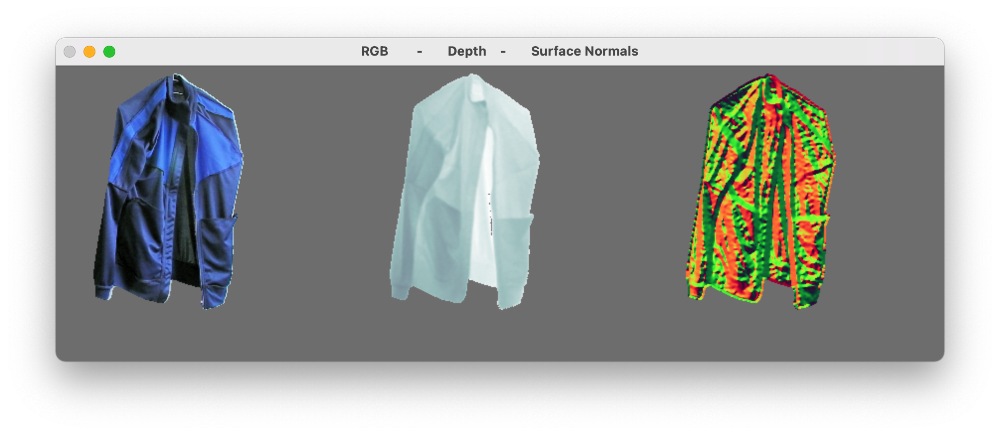

# Capturing RGB-D Data with a Kinect v2 device

This repository contains source code for using a Microsoft Kinect device to capture synchronised RGB images and
corresponding depth maps and surface normals.

## Installation

The source code was written in Python 3.9.6 and tested on macOS Big Sur 11.5.1. It requires the following packages:

- `numpy`
- `cython`
- `opencv-python`

Clone the repository and `cd` to the project directory. Project requirements can now be installed with `pip`. Using a
virtualenv is recommended, e.g., by running the following commands:

```
python3 -m venv venv
pip install --upgrade pip
pip install -r requirements.txt
```

Additionally, it also requires [`pylibfreenect2`](https://github.com/r9y9/pylibfreenect2), a Python wrapper
of [`libfreenect2`](https://github.com/OpenKinect/libfreenect2) which is an open-source driver for the Kinect for
Windows v2 device. For this,
follow [these installation instructions](http://r9y9.github.io/pylibfreenect2/stable/installation.html).

## Supported Devices

This code only works with the following Kinect v2 devices:

- Kinect for Windows v2
- Kinect for Xbox One

This is because `libfreenect2` does not support older devices.

**NOTE:** If you have a Kinect for Windows v1 or a Kinect for Xbox 360 sensor, you may still be able to adapt the code
by using [`libfreenect`](https://github.com/OpenKinect/libfreenect) instead.

### [Kinect v2](https://docs.depthkit.tv/docs/kinect-for-windows-v2)

Kinect for Windows V2 and Kinect for Xbox One are identical in how they function, with similar specifications which are
relevant for capturing synchronized RGB-D images.

#### Depth Sensor

The Kinect is a [time-of-flight camera](https://en.wikipedia.org/wiki/Time-of-flight_camera) which uses infrared light
to sense the distance between the camera and the subject for each point in the image. This IR data can be used to create
depth maps.

The depth sensor has a range of around 0.5m and 4.5m. It has a resolution of 512 x 424 pixels with a field of view (FoV)
of 70.6° x 60°, resulting in an average of around 7 x 7 depth pixels per degree

#### Color Sensor

The Kinect also has a regular RGB camera sensor. It has a resolution of 1920 x 1080px with a FoV of 84.1° x 53.8°,
resulting in an average of about 22 x 20 color pixels per degree.

## Getting the RGB-D data

After cloning the project and installing the dependencies as described above,

1. Connect the Kinect v2 device to your computer with a USB device.
2. `cd` to the `src` directory.
3. Run `python main.py -h` to see usage instructions.

This script allows you to record RGB-D data, compute surface normals, see a live camera feed of the data being
collected, and save all data in a specified location.



The saved data has the following format:

| Variable | Description                                        |     Range      |     Shape     |
| -------- | :------------------------------------------------- | :------------: | :-----------: |
| `color`  | The RGB image.                                     | 0.0 - 255.0    | 512 x 424 x 3 |
| `depth`  | The corresponding grayscale depth map.             | 0.0 - 1.0      | 512 x 424     |
| `norms`  | Surface normals as 3D unit vectors for each pixel. | 0.0 - 1.0      | 512 x 424 x 3 |

## Exporting 3D Mesh from Depth Image

See the [`export3d.py`](src/export3d.py) script for how to export a depth map image as a 3D mesh in `.obj` format, which
can then be imported into Blender or a similar tool.

## See samples of collected data

To visualize random samples from your data, run `python sample.py $DATASET_ROOT` with `$DATASET_ROOT` as full path of
the folder where you saved your dataset using the `main.py` program.